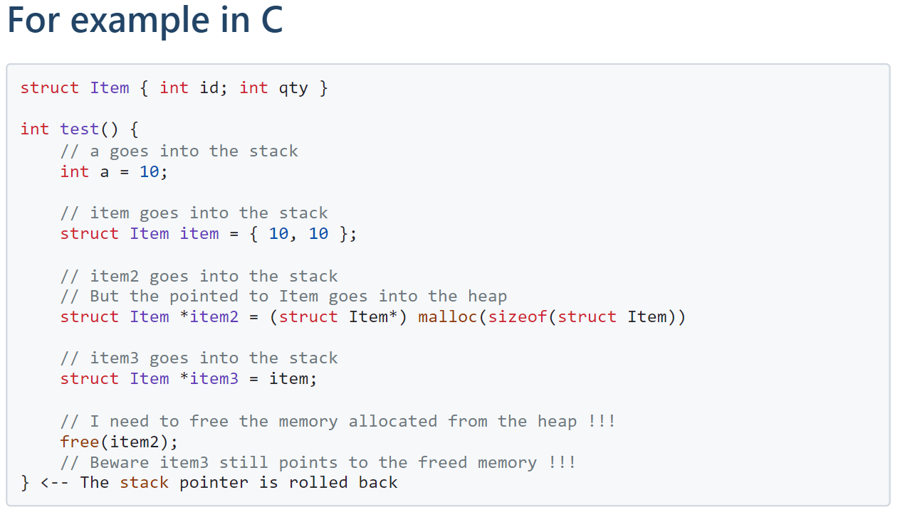
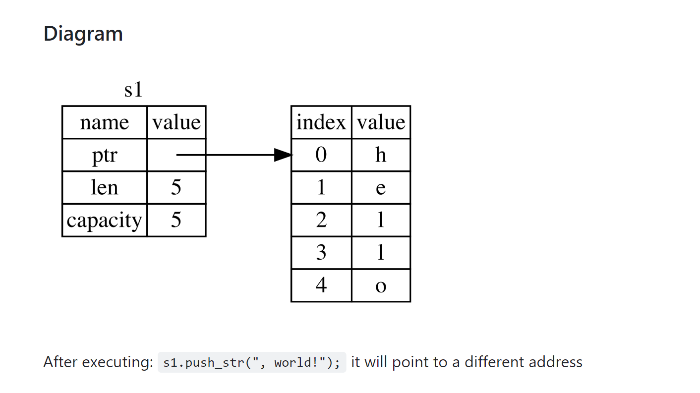
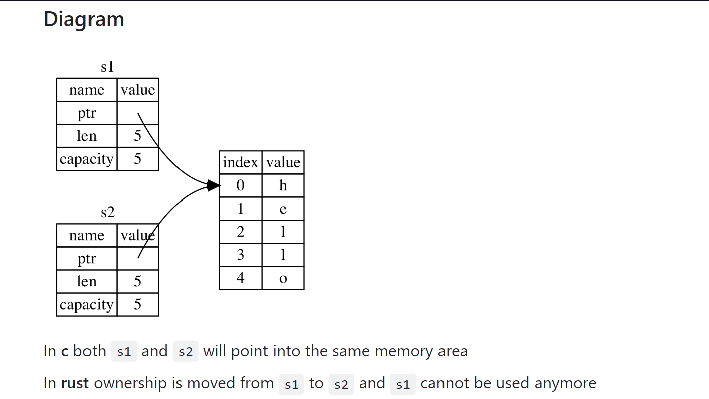

# Áreas de memoria
- **Text Segment**: se guardan los binarios del código del programa (read-only y shareable)
- **Data Segment**: guarda las constantes, datos estáticos y globales. Dividido en secciones Read-Only y Read-Write
- **Stack**: guarda los valores de las variables locales, y los valores de los parámetros pasados a las funciones
- **Heap**: guarda memoria dinámicamente alocada (memoria alocada en run time)



[//]: # (Me hinché las pelotas y pegué la imagen, no le puedo dar formato de código C )

Equivalente en Rust:
````rust
fn test() {
    let a = 10; // a goes into the stack
    
    // item1 goes into the stack
    let item1 = Item { id: 10, qty: 20 };
    
    // item2 is a reference it goes into the stack
    // The data referenced by item2 goes into the heap
    let item2 = Box::new(Item { id: 11, qty: 20 }); 
    
    // item3 goes into the stack
    // now the data is referenced by item3 
    // NOT by item2
    let item3 = item2;
} // <-- The stack pointer is rollbacked 
````
El compilador de Rust "sabe" que `item3` "posee" el objeto.
Entonces, cuando `item3` se elimina del stack, el valor al que hace referencia se elimina del heap.

Nota adicional: Acá arranca a hablar de cómo se van moviendo las direcciones de memoria a medida que se aloca la memoria para cada variable de una función ``factorial``, pero no lo veo necesario para incluir

# Ownership
- Cada valor en Rust tiene un **owner**
- Solo puede haber 1 a la vez
- Cuando el owner se va del scope, el valor se descarta

Ejemplo con `String`:
```rust
let s: &str = "hello";
let mut s1: String = s.to_string(); // String::from(s)

s1.push_str(", world!");
println!("s = {s}");
println!("s1 = {s1}");

Output:
s = hello
s1 = hello, world!
```
Notas:

- `"hello"` es una constante que va a la memoria `static`
- `s` es una referencia a un string 'raw' (`&str`)
- `s1` es un String que contiene dentro un `&str`



## Ownership movement
````rust
let mut s1 = "hello".to_string();
s1.push_str(", world!");
println!("s1 = {s1}");

let s2 = s1;           // Ownership moved to s2
println!("s2 = {s2}"); // Ok

println!("{s1}");  // No no...
````
Esto revienta, porque String no implementa el trait ``Copy``.
Para resolverlo tenemos 2 formas:
- Hacer que lo que estamos "moviendo" implemente dicho trait
- Pasar una referencia


````rust
let mut s1 = "hello".to_string();
println!("s1 = {s1}");

let mut s2 = s1.clone();   // Copy all
println!("s1 address: {:p}, s2 address: {:p}", &s1, &s2);

s2.push_str(", world!");

println!("{s1}");      // No problem now
println!("{s2}");      // s2 != s1
````

## Copy types
- Los tipos ``Copy`` son tipos que no mueven el ownership, sino que copian todos los datos cuando se asignan.
- Los siguientes son tipos ``Copy``:
    - Todos los tipos escalares: integers, floats, booleans y chars.
    - Tuplas de tipos escalares.
    - Tipos que implementan ``Copy`` y ``Clone``:
### Ejemplo
````rust
#[derive(Debug, Copy, Clone)] // Make Point implement Copy
struct Point {
    x: i32,
    y: i32
}

let p1 = Point { x:10, y: 20 };
let mut p2 = p1; // Copy here
p2.x = 100;

println!("p1 = {p1:?};");
println!("p2 = {p2:?};");
````
## Move into a function
Este concepto se repite en las funciones. Si le pasamos el valor directo a una función y luego lo queremos usar fuera de la función,
el compilador va a ``panickear``, "llorando" que el ownership fue transferido a la función que lo usó.
Para solucionarlo, tenemos que pasarle una referencia, aplicando el concepto de ``Borrowing``
```rust
fn length2(s: &String) -> usize {
    s.len()
}

let s1 = String::from("hello");

let len = length2(&s1); // <-- Here

println!("The length of '{s1}' is {len}.");
```
## Reglas para referencias
- Puedes tener cualquier número de referencias inmutables.
- Solo puedes tener una referencia mutable, excluyendo también las inmutables.
- Las referencias deben ser válidas (No puedes mantener una referencia a un valor fuera de su alcance).

[//]: # (El resto de este slide son ejemplos de lo anterior, pero se sobreentienden)