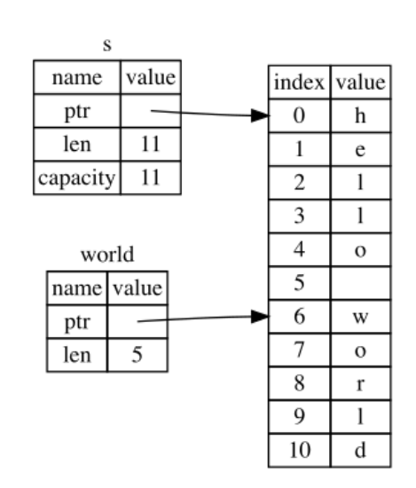

# Collections
- Slices
- Vectors
- Iterators
- Maps
## Slices
Son referencias a una parte de un tipo de dato "divisible", ya sea un String o un Array.
Ejemplo con String:
````rust
{
    let s = String::from("hello world");

    let hello = &s[..5];
    let world: &str = &s[6..];
    
    println!("s[0..5] = {hello}, s[6..11] = {world}");
}

Output:
s[0..5] = hello, s[6..11] = world
````
 Así queda la memoria: \
 

````rust
fn first_word(s: &String) -> &str {
    let bytes = s.as_bytes();
    for (i, &c) in bytes.iter().enumerate() {
        if c == b' ' {
            println!("{i}");
            return &s[0..i];
        }
    }
    &s[..]
}

let hw: String = "Hello World".to_string(); // String::from("Hello World")
let fw:&str = first_word(&hw);
println!("{fw}");

Output:
hello
````
Como bien se dijo, son referencias, por lo que siguen las reglas de ``Borrowing``.
````rust
let mut hw = "Hello World".to_string();
let fw = first_word(&hw);
  
hw.clear();
println!("{fw}");
````
Esto revienta porque estás queriendo printear una variable desde una referencia ``inmutable`` a la que se le hizo un ``clear()``, lo que sugiere un borrow ``mutable``.

````rust
let mut fw: &str; 
{
    let hw = "Hello World".to_string();
    fw = first_word(&hw);
}
println!("{fw}");
````
Esto ya revienta por lifetime.
No hace falta aclarar que los slices siguen siendo un tipo de dato, por lo que se pueden pasar como parámetro a distintas funciones

Se pueden crear slices a distintos arrays.

## Vectors
Los vectores son listas de items, son arrays con memoria dinámica (pueden crecer o decrecer). Análogos al ``ArrayList`` de Java.
````rust
let mut v = Vec::new();
v.push(10);
v.push(20);
println!("{v:?}")

// Se suelen inicializar los vectores con el macro vec!
let vector = vec![10, 20];
println!("{vector:?}")
````
### Accessing elements
````rust
let mut v = vec![10, 20, 30, 40];

// copy the element 
let first = v[0];
v[0] = 100;

// Using a reference
let second = &v[1];

// Using slices
let last2 = &v[v.len()-2..];
println!("All: {v:?}, first = {first}, second = {second}, last2 = {last2:?}")

Output:
All: [100, 20, 30, 40], first = 10, second = 20, last2 = [30, 40]
````

### Get (error handling)
En lugar de hacer un acceso directo (con `vec[index]`), se puede usar el método `vec.get(index)`, el cual devuelve un `Option` del tipo de dato que maneja el vector puntual.
Esto se hace para hacer operaciones más safe. El error handling es exactamente igual al que describimos anteriormente con el [Option]()

### Iterating with for
````rust
let v = vec![100, 32, 57];
for i in &v { // Nótese que es necesario pasar la referencia por cuestiones de ownership
    println!("{:p} {}", i, i); 
}
````

### Mutating during an iteration
````rust
let mut v = vec![0; 5];
let mut n = 0;
for i in &mut v {
    *i = n * n;
    n += 1;
}
println!("{v:?}");
````

### Iterators
Existen ``iterators`` como en Java. La idea es la misma, no hace falta explicarlo.
````rust
{
    let v1 = vec![1, 2];

    let mut v1_iter = v1.iter();
    println!("{:?}", v1_iter.next());
    println!("{:?}", v1_iter.next());
    println!("{:?}", v1_iter.next());
}
````

### Functions over ``iter``
````rust
let v1 = vec![1, 2, 100];
let total: i32 = v1.iter().sum();
let qty = v1.iter().count();
println!("total = {total}, qty = {qty}");
        
let v2: Vec<i32>= v1.iter().map(|x| x * 20).collect();
println!("New vector: {v2:?}");
````
### Iterator Flavours
#### iter vs into_iter vs iter_mut
- ``iter`` itera sobre referencias (&T)
- ``iter_mut`` itera sobre referencias `mutables` (&mut T)
- ``into_iter`` se adapta al contexto. Ya sea (``T``, ``&T`` o ``&mut T``)
````rust
let mut v1 = vec![1, 2];

let refs: Vec<&i32> = v1.iter().collect();

let mut_refs: Vec<&mut i32> = v1.iter_mut().collect();

let values: Vec<i32> = v1.into_iter().collect();
````

### Higher order functions over ``iter``
```rust
let v1 = vec![1, 3, 5, 7, 11, 13, 17, 19];
//Map y Flatmap

// Map
let squares:Vec<i32> = v1.iter().map(|x| x*x).collect();
println!("squares = {squares:?}");

let squares_and_cubes:Vec<_> = v1.iter().map(|x| [x*x, x*x*x]).collect();
println!("squares_and_cubes = {squares_and_cubes:?}");

// FlatMap
let squares_and_cubes:Vec<_> = v1.iter().flat_map(|x| [x*x, x*x*x]).collect();
println!("squares_and_cubes = {squares_and_cubes:?}");
```
````rust
// Filter, fold y reduce

// Filter: also see that a range is an iter
let odds: Vec<i32> = (1..20).filter(|n| n % 2 == 1).collect();
println!("odds = {odds:?}");

// Fold
println!("product: {}", v1.iter().fold(1, |acc, n| acc*n));

// Reduce
println!("product: {:?}", v1.into_iter().reduce(|acc, n| acc*n))
````

````rust
//Enumerate
{
    let v1 = "Hello World";
    // How to create a iter of characters
    let v1_characters: Vec <char > = v1.chars().collect();
    println ! ("{v1_characters:?}");
    
    let v1_pairs: Vec < _ > = v1.chars().enumerate().take(7).collect();
    println ! ("{v1_pairs:?}");
}
````

````rust
// Any y All
let v: Vec<_> = [1, 2, 3, 4, 20].iter().map(|x| x * x).collect();
println!("{v:?}");

//Any
println!("{}", v.iter().any(|&v| v > 100));

//All
println!("{}", v.iter().all(|&v| v > 100));

let ps:Vec<_> = (1..30)
.filter(|n| (2..n-1).all(|a| n % a != 0))
.collect();
println!("{ps:?}")
````
````rust
// For each
"Hello World".chars()
             .enumerate()
             .for_each(|(i,c)| println!("{i:2}: {c}"));

(1..3).flat_map(|x| x * 100 .. x * 110)
.enumerate()
.filter(|(i, x)| (i + x) % 3 == 0)
.for_each(|(i, x)| println!("{i}:{x}"));
````

````rust
// For each v2
let mut vx = vec![1, 2, 3, 4];

vx.iter_mut()
.for_each(|x| *x += 100); // Nótese que esto va a alterar las referencias mutables del vector

println!("{vx:?}");
````

## Infinite iterators
Misma idea que Haskell, prepara la expresión con valores posiblemente infinitos y toma los necesarios al hacer un ``take(N)``
````rust
let squares:Vec<_> = (1..).map(|x| (x, x*x)).take(5).collect();
println!("First 5 Squares: {squares:?}");

let primes = (1..).filter(|n| (2..n-1).all(|a| n % a != 0));
println!("First 10 primes: {:?}", primes.take(10).collect::<Vec<_>>());
````

# Maps
Misma idea que en cualquier lenguaje, es un diccionario que guarda ``(key, value)``
````rust
let mut prices = HashMap::new();
prices.insert("Apples", 2.50);
prices.insert("Oranges", 3.00);

println!("{}", prices["Apples"]);

if let Some(price) = prices.get("Apples") { // Nótese que el get() devuelve un Option
    println!("Apples cost: {price}")
}

// Map from array
let prices: HashMap<_,_> = HashMap::from_iter([("Apples", 2.50),
("Oranges", 3.00)]); // Esto compila, devuelve un hashmap. El iterable debe ser de tuplas de <K,V>
````

## Ownership en HashMap
- Si el valor es de tipo ``Copy`` (implementa el trait), el valor será copiado en el ``HashMap``.
- Otros valores serán movidos al ``HashMap``.
- Si insertamos referencias, su valor no será movido, por lo que los valores a los que apuntan las referencias deben ser válidos al menos mientras el ``HashMap`` sea válido.

````rust
let mut map = HashMap::new(); 
{
    let fruit = String::from("Apples");
    let price = String::from("10.20");
    map.insert(fruit, &price);    
}
println!("{map:?}");

// Esto explore por lifetime
````

## Iterating a Map
````rust
let prices: HashMap<_,_> = HashMap::from_iter([("Apples", 2.50),
                                               ("Oranges", 3.00)]);
for (fruit, price) in &prices { // Es iterable por default
    println!("{fruit:10} = {price}");
}
// Se puede llamar al método iter()
let v: HashMap<_,_> = prices.iter().map(|(k,v)| (k, v*1.5)).collect(); 
println!("{v:?}")
````

## Map methods
- ``insert``: Insert or Replace
- ``remove``: Remove the entry
- ``contains``: Check existence
- ``keys``: Return an iterator over the keys
- ``values``: Returns an iterator over the values
- ``entry``: returns an in-place entry that can be manipulated
  - ``or_insert``: insert if not present and return a reference to the value
  - ``or_default``: idem using the default for the type