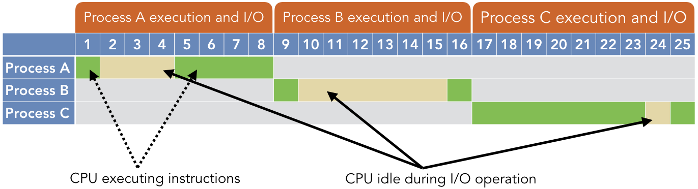
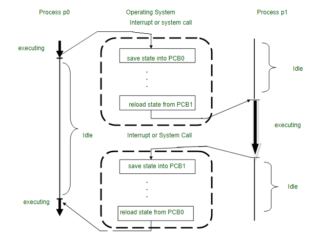
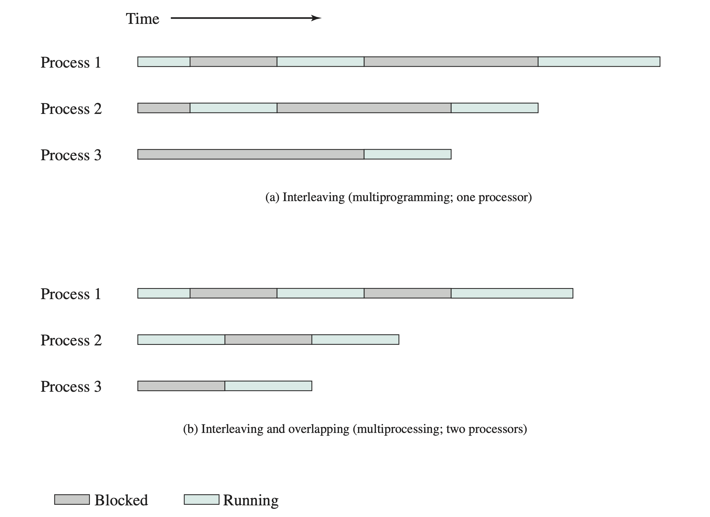

# Introducción
## Definición
La programación concurrente es un paradigma en el desarrollo de software que permite ejecutar múltiples tareas o procesos simultáneamente, ya sea mediante una ejecución paralela real (como en sistemas multicore o multiprocesador) o intercalando tareas de manera que parezca que se ejecutan al mismo tiempo.

[//]: # (TTodo lo de Ley de Moore me lo voy a meter bien en el orto)
> **Nota:**
> Es importante diferenciar un sistema **multicore** de uno **multiprocesador**, siendo el primero un sistema que tiene múltiples núcleos de procesamiento en un solo chip, mientras que el segundo tiene múltiples chips, cada uno con su propio núcleo.  
> En ambos casos, la programación concurrente permite aprovechar al máximo los recursos del sistema y mejorar el rendimiento de las aplicaciones.

> Todo esto de teoría va a ser un bodrio, va a estar mucho más simplificada la práctica

## ¿Por qué surge?
- La necesidad de mejorar el rendimiento y la eficiencia de los sistemas informáticos.
- La mayoría de los programas y sistemas eran single-threaded, por lo que había que reducir tiempos de ejecución.

Previo a hablar de programación concurrente, es importante entender el concepto de **multiprogramming**.
## Multiprogramming
- Permite que varios programas se carguen en memoria y se ejecuten de manera concurrente.
- El sistema operativo gestiona la ejecución de los programas, asignando tiempo de CPU a cada uno de ellos.
- Gestiona el tiempo de ejecución de cada programa con tal de que la CPU siempre esté ocupada.

## Sistemas Operativos y Time-Sharing
- Time-sharing: una extensión lógica de multiprogramación.
- El tiempo del procesador se comparte entre varios usuarios al mismo tiempo
- Se crea la ilusión de una máquina rápida y dedicada para cada usuario

## ¿Por qué aplicamos programación concurrente?
- Uso de recursos: uso eficiente del tiempo de inactividad durante operaciones de entrada/salida.
- Equidad: compartición equitativa de recursos entre múltiples usuarios o programas.
- Conveniencia: facilita la gestión de múltiples tareas o procesos.

[//]: # (Es necesario que hable de qué es un proceso?)

---

[//]: # (## Scheduling)

[//]: # (### Cooperativo)

[//]: # (Tasks voluntarily yield control of the CPU, allowing other tasks to run.)

[//]: # (#### Key Characteristics)

[//]: # (- Task Control: Tasks control their own relinquishment of the CPU.)

[//]: # (- Yielding: A task yields the CPU either when it's idle or when it decides to allow other tasks to run.)

[//]: # (- Advantages: Simplicity, low overhead, predictable resource utilization.)

[//]: # (- Challenges:)

[//]: # (  - Relies on tasks to be well-behaved. )

[//]: # (  - A single misbehaving task can hog the CPU, affecting system responsiveness.)

[//]: # (#### Ideal Use Cases)

[//]: # (- Environments where tasks can be trusted to yield regularly. )

[//]: # (- Systems prioritizing simplicity over multitasking efficiency.)

[//]: # ()
[//]: # (### Preemptive)

[//]: # (The operating system controls the execution of tasks, forcibly interrupting and resuming them as needed to ensure fair and efficient resource allocation.)

[//]: # (#### Key Characteristics)

[//]: # (- Controlled by OS: The OS when a task should relinquish the CPU.)

[//]: # (- Time Slicing: Tasks have CPU time slices and are preempted when they exceed it.)

[//]: # (- Advantages: Improved responsiveness, fairness, better handling of real-time.)

[//]: # (- Challenges:)

[//]: # (  - Higher complexity in implementation.)

[//]: # (  - Potential for resource contention and associated overhead.)

[//]: # (#### Ideal Use Cases)

[//]: # (- General-purpose operating systems.)

[//]: # (- Environments where tasks cannot be trusted to yield regularly.)

[//]: # (- Real-time systems needing guaranteed response times.)
No creo que se meta con toda la parte de scheduling, al menos en el contexto teórico, así que no lo pongo. Lo dejo comentado por las dudas.

---
[//]: # (Dudo que se pongan en gedes con cómo funciona un Context Switch, pero lo agrego igual)
# Context Switch
- The process of saving the state of a currently running task and loading the state of another task.

## ¿Qué guarda como estado?
- Program Counter: dirección de la siguiente instrucción
- Registros de la CPU en ese momento
- Stack: variables locales, parámetros de funciones, y direcciones de retorno
- Información de manejo de memoria y otros.

---
# Concurrencia vs Paralelismo vs Interleaving
## Concurrencia
- La concurrencia se refiere a la capacidad de un sistema para gestionar múltiples tareas u operaciones al mismo tiempo.
- No significa necesariamente que estas operaciones se estén ejecutando simultáneamente.
- En los sistemas concurrentes, diferentes partes de una tarea o múltiples tareas pueden estar en progreso al mismo tiempo, pero no necesariamente tienen que estar ejecutándose en el mismo momento exacto.
> La concurrencia trata sobre la estructura.

## Paralelismo
- El paralelismo se refiere a la ejecución de múltiples tareas o procesos simultáneamente.
- Esto requiere hardware con múltiples unidades de procesamiento, como procesadores multi-núcleo.
- En los sistemas paralelos, las tareas se ejecutan literalmente al mismo tiempo, como líneas de ensamblaje paralelas en una fábrica trabajando simultáneamente.
> El paralelismo trata sobre la ejecución.

## Interleaving / Intercalado
Una técnica para alternar rápidamente entre tareas, ejecutándolas en pequeños fragmentos.

### Características clave
- Simula el paralelismo.
- Enfoque de compartición de tiempo: el tiempo de CPU se divide entre múltiples procesos en sucesión rápida.
- Eficiencia: proporciona una utilización eficiente de la CPU al reducir el tiempo de inactividad durante las tareas, como las operaciones de entrada/salida.
- Ejemplo: un chef que prepara múltiples platos alternando entre ellos, en lugar de cocinar cada uno de principio a fin.
### Contraste con Overlapping
