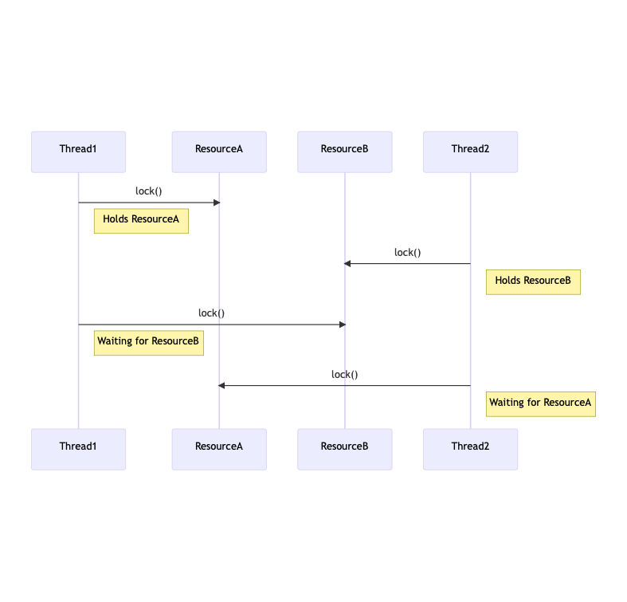

# Exclusión Mutua

### La raíz del problema
- No determinismo causado por hilos concurrentes accediendo a un estado mutable compartido.
- Ayuda encapsular el estado en actores o transacciones, pero el problema fundamental sigue siendo el mismo.

### No determinismo = procesamiento paralelo + estado mutable.
- Para obtener un procesamiento determinista, ¡evita el estado mutable!
- Evitar el estado mutable significa programar funcionalmente.

## Condición de carrera
Una condición de carrera ocurre cuando dos o más operaciones deben ejecutarse en una secuencia específica.

Pero el comportamiento sustantivo del sistema no está garantizado.

Llevando a resultados erráticos e impredecibles.

Es un poco obvio a este punto; si quieren un ejemplo vean el slide, con lo del contador en Java que lo pueden mutar.

### Solución: Forzar Acceso Único
Si forzamos una regla de que solo un proceso puede entrar al método incrementar a la vez entonces:

- Thread1 entra a incrementar primero y crea un bloqueo
- Thread2 intenta entrar pero es bloqueado
- Thread1 completa la ejecución y libera el bloqueo
- Thread2 se reanuda y ejecuta incrementar

Nótese que el keyword `synchronized` en Java es un ejemplo básico de un lock (específicamente de un Mutex).
- Si se hace sobre un método, el lock es sobre el objeto que contiene el método.
- Si se hace sobre un bloque, el lock es sobre el objeto que se le pasa al bloque.
- Si se hace sobre una variable o atributo de la clase, el lock es sobre la variable o atributo.
- Si se hace sobre un método estático, el lock es sobre la clase.
  - Esto último lo busqué.

# Memoria compartida entre hilos
En el ejemplo del slide en el que es virtualmente imposible que falle, la falla se da\
porque el thread que falló leyó memoria vieja (que ya no existe) respecto a una de las 2 variables, y actualizó la otra.

Es difícil compartir la memoria entre threads debido a estas cuestiones, por lo que en distintos lenguajes se implementan distintas formas de hacerlo.

En Java, se usa el keyword `volatile`.

Esto fuerza a la JVM a sincronizar la variable hacia y desde la memoria compartida\
Volatile es ligero y más rápido que el bloqueo

Ahora, otro de los problemas principales de la memoria compartida es que los procesos van a \
competir por recursos.

## Deadlock
Deadlock puede ser definido como el bloqueo permanente de un conjunto de procesos que compiten por recursos.
Un conjunto de procesos está en deadlock cuando cada proceso en el conjunto está bloqueado
esperando por un recurso que está retenido por otro proceso bloqueado en el conjunto.

## Starvation
Una situación donde a un proceso se le niegan perpetuamente los recursos que necesita para progresar,
mientras que otros procesos son favorecidos,
llevando a una espera indefinida.
En resumen, un proceso se muere de hambre porque quiere acceder a un recurso y siempre se le deniega dicho acceso.

Después se pone a hablar de cómo se resuelven estas situaciones en Java, pero no lo veo necesario de incluir.

Son casos demasiado puntuales que dudo que nos metamos, usando `compareAndSet()`, `volatile`, entre otros.

Por último dice que Rust no puede tener condiciones de carrera porque es un lenguaje de verdad y el borrow checker lo evita (al menos con una variable mutable).\
En casos más complejos lo resuelve de otra manera.