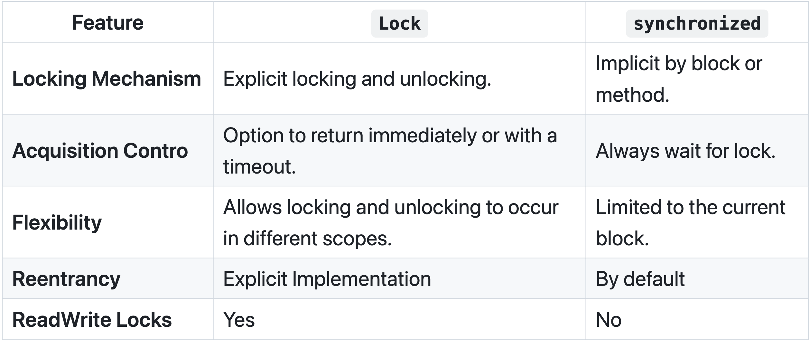

# Abstracciones de Concurrencia - Parte I

## Lock

Un lock (o mutex de exclusión mutua) es una primitiva de sincronización que previene que el estado sea modificado o accedido por múltiples hilos de ejecución a la vez.

- Cuando un hilo quiere acceder a un recurso compartido, primero intenta adquirir el lock asociado con ese recurso.
- Si el lock está disponible (i.e., no está siendo retenido por otro hilo), el hilo adquiere el lock, accede al recurso, y luego libera el lock cuando termina.
- Si el lock no está disponible (i.e., actualmente retenido por otro hilo), el hilo que lo solicita es bloqueado para proceder hasta que el lock esté disponible.

### Tipos de Lock

- **Mutex (Exclusión Mutua)** : Un lock básico que permite que solo un hilo acceda a un recurso a la vez.
- **Reentrant Lock**: Puede ser adquirido múltiples veces por el mismo hilo sin causar un deadlock.
- **Read/Write Locks**: Permite que múltiples lectores accedan al recurso simultáneamente pero requiere acceso exclusivo para escritura.

Acá en el medio pone el ejemplo de la cuenta de banco, de cómo estos 3 tipos de lock se pueden usar para este caso,
etc. \
Si quieren lo agrego, pero no creo que haga falta; a lo sumo haría falta un ejemplo del Reentrant.



### En un lenguaje de verdad...

- Un **mutex** en **Rust** es un dato con un lock que protege su acceso.
- Para acceder al dato dentro del mutex, un thread tiene que avisar que quiere acceder pidiendo adquirir el lock del mutex.
- `lock` devuelve un Smart Pointer al valor dentro del Mutex.
  - Devuelve un `MutexGuard<T>`
- Mutex sólo le permite a un thread a la vez acceder al dato.

```rust
use std::sync::Mutex;

pub struct BankAccount {
    balance: Mutex<f64>
}
impl BankAccount {
    pub fn new(initial_balance: f64) -> BankAccount {
        BankAccount {
            balance: Mutex::new(initial_balance)
        }
    }
    pub fn deposit(&self, amount: f64) {
        let mut balance = self.balance.lock().unwrap();
        *balance += amount;
        println!("Deposited: {}", amount);
    }

    pub fn withdraw(&self, amount: f64) {
        if let Ok(mut balance) = self.balance.lock() {
            if *balance >= amount {
                *balance -= amount;
                println!("Withdrawn: {}", amount);
            } else {
                println!("Insufficient balance for withdrawal");
            }
        }
    }

    pub fn get_balance(&self) -> f64 {
        *self.balance.lock().unwrap()
    }
}
```

## Livelock
Es una condición que tiene lugar cuando 2 o más threads cambian su estado continuamente, sin que ninguno de ellos haga progreso.

Esto lo hace ver con el ejemplo del `problema de los filósofos`, en la variante donde todos agarran primero el tenedor
derecho y el último lo da vuelta (agarra el izquierdo).\
Recordemos que en el caso donde todos intentan agarrar primero el derecho se produce un **deadlock**.

## Reader Writer Lock

Also known as a shared-exclusive lock or a multiple readers/single writer lock.
También conocido como un lock compartido-exclusivo o un lock de múltiples lectores/un único escritor.

- Es un mecanismo de sincronización para manejar situaciones donde un recurso puede ser accedido por múltiples hilos
  simultáneamente.
- Este tipo de lock permite acceso concurrente de solo lectura al recurso compartido, mientras que las operaciones de
  escritura requieren acceso exclusivo.

Son útiles en escenarios de alta concurrencia donde las lecturas son frecuentes y las escrituras son poco frecuentes.

1. Múltiples threads pueden sostener el lock de lectura simultáneamente, siempre y cuando ningún thread sostenga el lock de escritura.
2. Solo un thread puede sostener el lock de escritura a la vez. Cuando un thread sostiene el lock de escritura, ningún otro thread puede sostener el lock de lectura o escritura.
3. Se pueden implementar con diferentes políticas de prioridad, como dar preferencia a los lectores, escritores o ninguno.
4. La elección de la política puede afectar el comportamiento del lock en términos de equidad y potencial de `Starvation`.

### Ejemplo

```rust
impl BankAccountRW {
  pub fn new(initial_balance: f64) -> BankAccountRW {
    BankAccountRW {
      balance: RwLock::new(initial_balance)
    }
  }

  pub fn deposit(&self, amount: f64) {
    if let Ok(mut balance) = self.balance.write() {
      *balance += amount;
      println!("Deposited: {}", amount);
    }
  }

  pub fn get_balance(&self) -> f64 {
    *self.balance.read().unwrap()
  }
}
```

## Semáforos
Son una primitiva de sincronización usada en programación concurrente.\
Proveen un mecanismo para controlar el acceso a recursos compartidos por múltiples procesos o hilos.

En definitiva, es un contador con 2 operaciones principales:
- `down (P)` o `acquire`: Decrementa el contador. Si el contador es menor a 0, el hilo se bloquea hasta que se libere.
- `up (V)` o `release`: Incrementa el contador. Si el contador era 0 o menor, despierta a un hilo bloqueado.

### Tipos de semáforos
- **Semáforo binario**: Puede tomar solo los valores 0 o 1. Se usa para implementar exclusión mutua.
  - El `Mutex` o `Lock` común que conocemos es de este tipo.
    - `Mutex` de Rust y `Lock` de Java
- **Semáforo contable**: Puede tomar cualquier valor entero no negativo. Se usa para controlar el acceso a un número
  limitado de recursos.
```java
public class Counter {
    int value = 0;
    Semaphore semaphore = new Semaphore(1, true);

    void increment() {
        semaphore.acquire();  // wait or down or P

        int local_counter = value;
        local_counter = local_counter + 1;

        value = local_counter;
        semaphore.release();  // signal or up or V
    }
}
```

