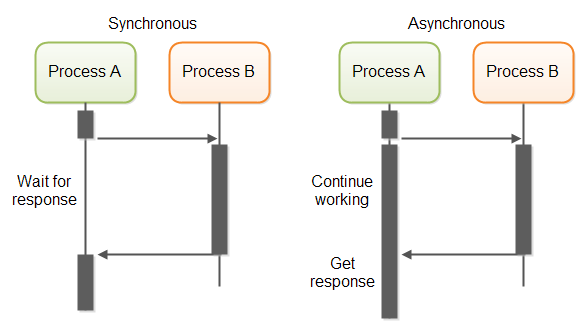

# Abstracciones de Concurrencia - Parte II
## Variables de Condición
Tienen como propósito hacer que los threads esperen una condición específica sin consumir recursos. 
Similar a los semáforos, tienen 2 operaciones principales:
- **Esperar**: un thread espera a que una condición se cumpla. Si no se cumple, libera el Mutex asociado para evitar condiciones de carrera.
- **Señalizar**: un thread notifica a otro que la condición se ha cumplido. Esto despierta al thread que estaba esperando.

### Ejemplo de uso
```rust
// Sin condvar:
let queue = Mutex::new(VecDeque::new());

thread::scope(|s| {
   s.spawn(|| {
            loop { // Busy loop !!
                let mut q = queue.lock().unwrap();
                if let Some(item) = q.pop_front() {
                    println!("Popped: {item}", );
                }
            }
        });

    for i in 0.. {
        queue.lock().unwrap().push_back(i);
        thread::sleep(Duration::from_secs(1));
    }
});
```
```rust
// Con condvar:
let queue = Mutex::new(VecDeque::new());
let not_empty = Condvar::new();

thread::spawn(||{
    loop {
        let mut q = queue.lock().unwrap();
        if let Some(item) = q.pop_front() {
            println!("Popped: {item}", );
        } else {
            not_empty.wait(q); // <--- Wait
        }
    }
});

// Pushear elementos:
for i in 0.. {
    queue.lock().unwrap().push_back(i);
    not_empty.notify_one(); // <-- notify the first thread waiting
    thread::sleep(Duration::from_secs(1));
}
```

### Beneficios
- Efficient waiting mechanism in concurrent programming.
- Facilitates complex synchronization scenarios.

Acá pone el ejemplo del CircularBuffer, pero creo que con la Queue es suficiente.

## Monitores
Es una primitiva de sincronización que le permite a los threads tener:
- Exclusión mutua
- La capacidad de bloquear la ejecución si no se cumple una condición específica
- Un mecanismo de notificación para despertar threads que están esperando por la misma condición

En resumen, es un `Mutex` + una `CondVar`

En Rust no existen los monitores como tal, pero se pueden implementar usando `Mutex` y `Condvar`.

En Java sí están built-in, pero no como objeto, sino mediante el uso del keyword `synchronized` y los métodos `wait()`, `notify()` y `notifyAll()`. 
```java
class Account {
    double balance;
    synchronized public void withdraw(double amount) throws InterruptedException {
        if (amount <= 0) return;

        while (balance < amount) {
            // Wait for enough balance");
            wait();
        }
        balance -= amount;
    }

    synchronized public void deposit(double amount) {
        if (amount > 0) {
            balance += amount;
            notify(); // Notify that some money have been deposited
        }
    }
}
```

## Pasaje de mensajes
La idea de los mensajes es evitar la comunicación entre threads mediante la compartición de memoria. Esto lo logra "intentándolo al revés", es decir, compartiendo memoria a través de la comunicación.


- In message-passing approach, the information to be shared is physically copied from the sender process address space to
the address spaces of all receiver processes
- This done by transmitting the data in the form of messages
- A message is a block of information

### Mensajes síncronos vs. asíncronos


Aquí tienes la tabla traducida al español:

| Característica        | Síncrono                                  | Asíncrono                                    |
| --------------------- | ----------------------------------------- | -------------------------------------------- |
| Sincronización        | El emisor espera a que el receptor obtenga el mensaje | El emisor continúa sin esperar               |
| Control de Flujo      | Automático mediante el bloqueo del emisor | Requiere gestión explícita                   |
| Complejidad           | Menor, debido a la coordinación directa  | Mayor, debido al manejo indirecto            |
| Caso de Uso           | Ideal para tareas estrechamente acopladas | Ideal para tareas independientes             |
| Rendimiento           | Puede ser más lento debido a las esperas | Mayor, ya que no implica esperas             |
| Utilización de Recursos | Menor durante las esperas               | Mayor, ya que las tareas siguen ejecutándose |

En Rust esto se logra a través de los canales, que usamos en uno de los primeros TPs.

```rust
fn channels_example() {
    // Create a channel
    let (sender, receiver) = mpsc::channel();
    // MPSC = Multiple Producer, Single Consumer
    // Spawn a new thread
    thread::spawn(move || {
        // Send a message to the channel
        let msg = "Hello from the spawned thread!";
        sender.send(msg).unwrap();
        println!("Sent message: '{}'", msg);
    });

    // Receive the message in the main thread
    let received = receiver.recv().unwrap();
    println!("Received message: '{}'", received);
}
```
```rust
// Create a Channel:
let (sender, receiver) = mpsc::channel();

// Spawn many threads
    for tid in 0..10 {
        let s = sender.clone();   // <--- Clone the sender part
        thread::spawn(move || {
            // Send a message to the channel
            let msg = format!("Hello from thread! {tid}");
            println!("Sent message: '{}'", msg);
            s.send(msg).unwrap();
        });
    }
```
