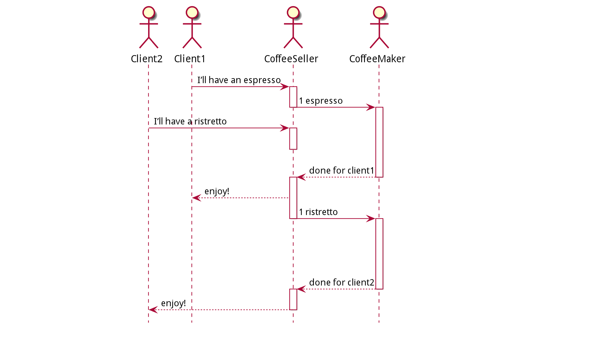

# Programación asíncrona

### Ejemplo: pedir un café

#### De manera síncrona

**Aclaración**: Cada cajero tiene una máquina de café

- El cliente 1 le pide al cajero un café.
- El cajero hace el café
- El cajero le da el café al cliente 1
- Luego viene el cliente 2 y repite la secuencia

##### Consideraciones

- Mientras se está haciendo el café, el cajero se queda esperando, no puede hacer nada más en ese "tiempo muerto".
- El cliente 2 no es atendido por nadie, ni siquiera se encola el pedido de café mientras el café del cliente 1 se está
  haciendo.

#### Manera síncrona con 2 vendedores de café

- Existe un cajero por cliente, entonces se resuelve, pero es más caro (?)

#### De manera asíncrona



- Se manejan de mejor manera los tiempos "muertos".
- Una vez se pide el café, se manda a hacer, y se pueden seguir recibiendo pedidos.
- Una vez termine el primer café, se lo da al primer cliente, y luego se manda a hacer el segundo
- Esto ahorra 1 cajero y 1 máquina de café, haciéndolo prácticamente en el mismo tiempo que con 2.

## Ejecución Asíncrona

- Es la ejecución de una operación de cómputo en otra unidad de cómputo
- No se espera "activamente" a que dicha operación termine, sino que se "manda a hacer en el background"
- Se usan los recursos de manera más eficiente

### ¿Qué pasa si una función depende del resultado de otra?

```kotlin
fun coffeeBreak() {
    val coffee = makeCoffee()
    drink(coffee)
    chatWithColleagues()
}

fun makeCoffee(): Coffee {
    println("Making Coffee")
    // Work for some time
    return Coffee()
}

fun drink(coffee: Coffee) { }
```

#### Solución usando Callbacks

```kotlin
fun coffeeBreak() {
    // MakeCoffee recibe un lambda para interpretar que no hace falta quedarse esperando a que termine
    makeCoffee { coffee ->
        drink(coffee)
    }
    chatWithColleagues()
}

fun makeCoffee(coffeeDone: (Coffee) -> Unit) {
    println("Making Coffee")
    // Work for some time
    val coffee = Coffee()
    coffeeDone(coffee)
}

fun drink(coffee: Coffee) { }
```

- `makeCoffee()` es lanzable en otro thread, tranquilamente.

## De Sync hacia Async

Para transformar una función de Sync a `async` (o al menos su firma), se debe:

- No devolver un valor
- Tomar como parámetro una **continuación** que defina qué hacer una vez devuelto el valor computado.
- Esta continuación en definitiva termina siendo un lambda

```kotlin
fun program(a: A): B { 
    // Do Something
    return B()
}
```

Se lo transforma en CSP (Continuous Passing Style)

```kotlin
fun asyncProgram(a: A, c: (B) -> Unit) {
    // Do Something
    c(B())
}
```

### Callback Hell

¿Qué sucede si otro programa depende de que el coffee break haya terminado?

Por ejemplo, una conferencia incluye un coffee break en el medio:

```kotlin
fun coffeeBreak(breakDone: ()->Unit)
```

```kotlin
fun conference() {
    presentation { p1 ->
        coffeeBreak {
            presentation { p2 ->
                endConference(p1, p2)
            }
        }
    }
}
```

Esto se vuelve ilegible, en definitiva. Escala muy poco.

## Futures

Es análogo al `Promise` de `JS/TS`. Es una "promesa" o un registro de que se llamó a una función asíncrona, por así
decirlo.

Este Future va a devolver un valor en algún momento (cuando quiera usar el valor).

Se propaga "para arriba" en la jerarquía de llamados el cuándo espero por el valor.

En el caso del ejemplo del café, se hace cuando quiera tomar el café, por ejemplo.

Se intenta pasar de esto:

```kotlin
fun program(a: A): B {}
// CSP
fun program(a: A, k: (B) -> Unit) {}

```

A esto:

```kotlin 
fun program(a: A): Future<B> {}
```

### Currying

Esencialmente, pasamos de esto:

```kotlin
fun program(a: A, k: (B) -> Unit) : Unit {}
```

A esto:

```kotlin
fun program(a: A): ((B) -> Unit) -> Unit {}

```

Usando Currying (como en Haskell)

```haskell
add :: Num a => a -> a -> a
add x y = x + y

-- The type of `add 10` will be
add 10 :: Num a => a -> a
```

### Ejemplo del Café usando `Future`

```kotlin
fun makeCoffeeFuture(): Future<String> {
    return CompletableFuture.supplyAsync {
        println("Making Coffee")
        sleep(2000)
        "coffee ${coffeeNumber.incrementAndGet()}"
    }
}
// Función principal
fun futureCoffeeBreak() {
    val f: Future<String> = makeCoffeeFuture() // Mando a hacer el café
    chatWithColleagues() // Me pongo a charlar con mis amigos, o a hacer otra cosa
    drink(f.get()) // Me tomo el café una vez listo
}
```

- `Future.get()` espera a que el valor esté listo para usar, devolviéndolo.
- Nótese que `coffeeNumber` es un `AtomicInteger`, justamente para mantenernos en el contexto concurrente.

#### De manera non-blocking con Futures

```kotlin
import java.util.concurrent.CompletableFuture

fun futureCoffeeBreak() {
    val f: CompletableFuture<String> = makeCoffeeFuture()
    f.thenAccept { coffee ->
        drink(coffee)
    }
    chatWithColleagues()
}
```

### Combinando Futures

```kotlin
fun futureCoffeeBreakBlended() {
    val f1 = makeCoffeeFuture()
    val f2 = makeCoffeeFuture()
    val combinedFuture = f1.thenCombine(f2) { result1, result2 ->
        "$result1 blended with $result2"
    }
    combinedFuture.thenAccept { c ->
        drink(c)
    }
    chatWithColleagues()
}
```

### En definitiva, los Futures son Monads
Cabe recordar que un Monad en Haskell es una interfaz para
distintas estructuras de control.

```haskell
blendedCoffee = 
    do 
        coffee1 <- makeCoffeeFuture 
        coffee2 <- makeCoffeeFuture
        return coffee1 ++ " Blended With " ++ coffee2 
```


