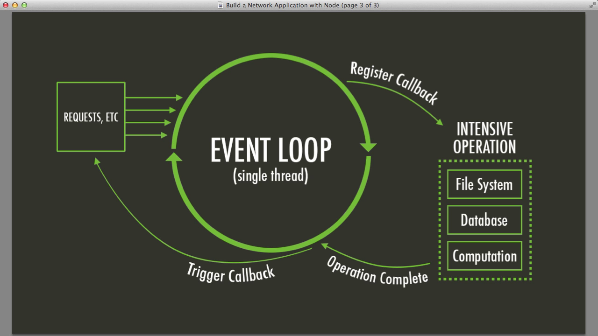
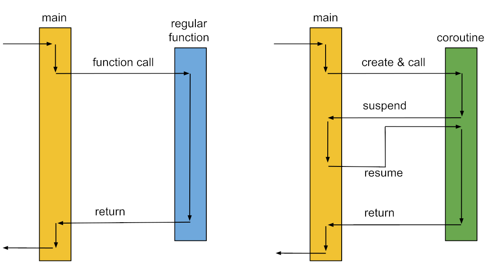

# Programación Asíncrona - Continuación

### En JavaScript se los llama `Promises`

```javascript
let coffeeNumber = 0;

function makeCoffeePromise(): Promise<string> {
    return new Promise((resolve) => {
        console.log("Making Coffee");
        setTimeout(() => { // Equivalente al sleep(2000)
            coffeeNumber += 1;
            // Al terminar una promesa se llama a este método para devolver un valor
            resolve(`coffee ${coffeeNumber}`);
        }, 2000);
    });
}

function coffeeBreak() {
    const f: Promise<string> = makeCoffeePromise();
    f.then(coffee => {
        drink(coffee);
    })
    chatWithColleagues();
}
```

#### Syntax Sugar para el Async/Await

```javascript
async function coffeeBreak(): Promise<void> {

    const f: Promise<string> = makeCoffeePromise();
    chatWithColleagues();

    const coffee = await f;
    // The code below will be executed when the promised is fullfilled
    drink(coffee);

    // Promised is propagated! 
}
```

### JavaScript es Single-Threaded

- Originado en el browser: javascript fue diseñado para manipular el DOM en navegadores web.
- El modelo single-threaded previene conflictos e inconsistencias.
- Event Loop: javascript opera sobre un modelo basado en eventos. El bucle de eventos verifica tareas como entradas de
  usuario, solicitudes de red y temporizadores.
- Asegura la capacidad de respuesta procesando un evento a la vez.
- Como no puedo levantar threads en el Browser, en JS se tiene que pensar la programación de manera asíncrona



## Corutinas

- Subrutinas vs. Corutinas
    - Las funciones (o llamados a estas) que conocemos en definitiva son subrutinas
    - Subrutinas: 1 entrada, 1 salida
    - Corutinas: N puntos de entrada, puede pausarse y reanudarse
- Ceder ejecución
    - Las corutinas pueden cederle el control de vuelta a los "callers", que son quienes la invocan
    - Reanudan desde el punto donde las pausaron
      

### Ejemplo del café con corutinas

```kotlin
suspend fun makeCoffee(): String {
    println("Making Coffee")
    delay(2000)  // Using delay from kotlinx.coroutines instead of Thread.sleep
    return "coffee ${coffeeNumber.incrementAndGet()}"
}

fun coffeeBreakWithCoroutines() = runBlocking {
    // Las corutinas sólo pueden invocarse dentro del scope de un launch
    launch {
        val coffee = makeCoffee()
        drink(coffee)

    }
    chatWithColleagues()
}
```

- `suspend` indica que es una función que se puede suspender, ergo, una `coroutine`
- Una corutina puede llamar otra dentro suyo
    - Por adentro pueden alocarlas distintos threads
    - Si la aloca el mismo thread, el flujo se sigue de la siguiente manera:
        - Va al Launch, empieza la corutina
        - Empieza a ejecutar
        - Hace un yield en el delay de `makeCoffee()` e invoca `chatWithColleagues()`
        - Vuelve a `makeCoffee()`, devuelve el valor, y ejecuta el `drink(coffee)` de la `main routine`
- `runBlocking` hace que la función se ejecute en su totalidad
- En una corutina se puede ceder el control usando `return` o `yield`.
    - `return` es implícito, `yield` es explícito

Las corutinas están pensadas para que, en un mismo hilo, yo pueda tener una ejecución paralela que se realiza con un
interleaving.
Es una forma colaborativa de tener concurrencia, similar a los `virtual threads`.

En runtime (en el caso particular de Kotlin) te permite tener un dispatcher, al que se le pueden alocar a varios
threads.
El dispatcher te permite que una corutina no necesariamente se quede esperando.

### Beneficios

- Código más simple
    - Código asíncrono que parece síncrono
    - Más fácil de leer y mantener
- Concurrencia
    - Se pueden manejar múltiples tareas de manera concurrente
    - Evita la complejidad de threads
    - Muy liviano

### Concurrencia liviana

```kotlin
fun main() = runBlocking {
    for (i in 0..50_000) { // ejecuto la misma corutina 50.000 veces
        launch {
            println("Hello $i!")
            delay(5000L)
        }
    }
}
```

Si no estuviera el `launch`, tardaría aproximadamente 250.000 segundos

Como existe el launch, tarda un poquito más de 5 segundos (por lo que tarda en imprimir, también) por el cambio entre
las rutinas, ya que hace el "salto" justo antes del `delay`.
Se interrumpe y salta a la siguiente corutina justo antes del llamado al delay.

## Secuencias (colección Lazy)

No tiene que ver de manera directa con concurrencia, pero es la forma más pura de escribir una corutina.

El `yield` está explícito.

```kotlin
val fibonacciSeq: Sequence<Int> = sequence {
    yield(1)
    yield(1)
    var a = 1;
    var b = 1

    while (true) {
        val result = a + b
        yield(result)
        a = b; b = result
    }
}

fun main() = fibonacciSeq.take(10).forEach { print("$it ") }
```

- `sequence` invoca una lambda y la irá llamando a medida que se lo pida.
    - Producen elementos a pedido (lazy)
    - Esa lambda es una corutina, en definitiva.
- Si no se usa con `sequence`, se debería armar usando un `Iterator`
- `yield` funciona parecido a `return` pero no finaliza la corutina. Simplemente la interrumpe.
    - Cuando se vuelve a llamar la corutina, sigue desde el punto siguiente al `yield`.

### Ejecución paralela vs. secuencial

```kotlin
suspend fun doSomethingUsefulOne(): Int {
    delay(1000L); return 13
}

suspend fun doSomethingUsefulTwo(): Int {
    delay(1000L); return 29
}
fun main() = runBlocking {
    val time = measureTimeMillis {
        val one = doSomethingUsefulOne()
        val two = doSomethingUsefulTwo()
        println("The answer is ${one + two}")
    }
    println("Completed in $time ms")
}
```

Como estoy pidiendo un resultado (la suma de ambos resultados de las corutinas), se ejecutará todo secuencial

#### Paralela

```kotlin
fun main() = runBlocking {
    val time = measureTimeMillis {
        val one = async { doSomethingUsefulOne() }
        val two = async { doSomethingUsefulTwo() }
        println("The answer is ${one.await() + two.await()}")
    }
    println("Completed in $time ms")
}
```

Clavarle el `async` fuerza que se te vaya una de las 2 corutinas a otro thread

Es "paralelo" porque los procesos se hacen en paralelo, pero termina siendo una ejecución secuencial del main porque
tenés que esperar los resultados

## Threads vs. Fibers vs. Corutinas

| Concepto                                     | Estado                                                  | Ejecutado por                   | Unidad de suspensión                                                                    |
|----------------------------------------------|---------------------------------------------------------|---------------------------------|-----------------------------------------------------------------------------------------|
| **Hilo (Thread a nivel S.O)**                | Stack de modo usuario + Stack de modo kernel + contexto | Scheduler del sistema operativo | Hilo completo; la CPU queda libre para ejecutar otros hilos                             |
| **Fiber (User-Mode-Thread, Virtual Thread)** | Stack de modo usuario + contexto                        | Algún hilo                      | Fiber; el hilo subyacente queda libre para ejecutar otras tareas                        |
| **Corutina**                                 | Variables locales + contexto                            | Algún hilo o fiber              | Corutina; el hilo o fiber subyacente queda libre para ejecutar otras corutinas o tareas |

>Lo único que la corutina precisa mantener como estado son las variables que está utilizando, que son las propias.