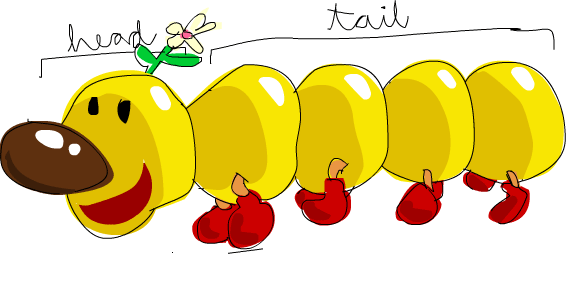
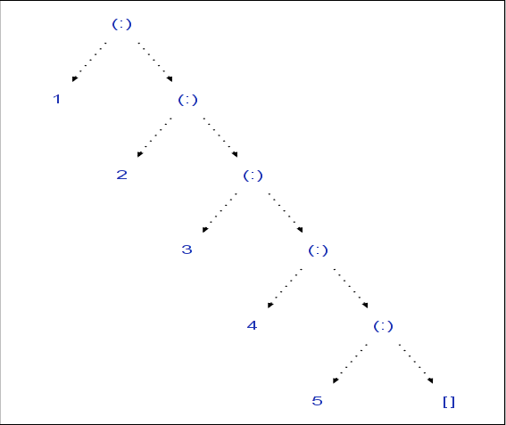
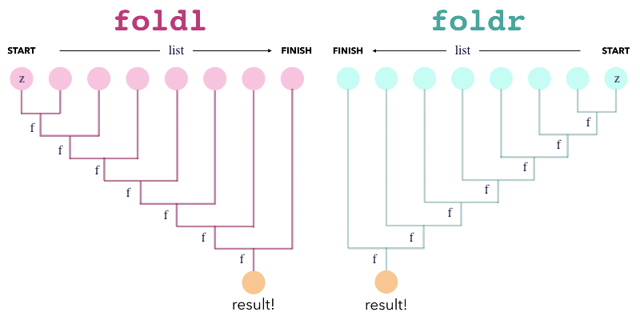

# Lists & Higher Order Functions
Una lista en Haskell es una colección de elementos del mismo tipo. No puedo tener una lista del estilo
```clojure
[1 "hello" :world]
```
como en Clojure.

```haskell
fibo = [1, 1, 2, 3, 5]
fact = [1, 2, 6, 24, 120]
(fibo, fact) -- Output: ([1, 1, 2, 3, 5], [1, 2, 6, 24, 120])
```

Un String es una lista de caracteres
```haskell
"abcd" == ['a', 'b', 'c', 'd'] -- Output: true
```

```haskell
fibo ++ fact -- Output: [1, 1, 2, 3, 5, 1, 2, 6, 24, 120]
fact !! (3+1) -- Output: 120. El operador doble bang (!!) se usa para agarrar el elemento de la lista en un índice dado. Es como hacer en cualquier otro lenguaje `list[i]`
```
## Head & Tail

Las listas en haskell son listas enlazadas por default.
A list can be either:
- The null list
- Or a pair head and tail

The head is an element; The tail is another list.

```haskell
l = [1, 2, 3]
head l -- Output: 1
tail l -- Output: [2, 3]
```
## Cons
Se puede usar el operador `cons (:)` para desestructurar/construir una lista

```haskell
l1 = 1 : 2 : 3 : 4 : 5 : []
l1 == [1, 2, 3, 4, 5]

l2 = 1 : 2 : 7 : (tail $ tail $ tail l1)
(l2, l1)
```
## Ranges
You can create a list using the syntax `[first..last]` or `[first, second .. last]`
```haskell
[1..10]
[1,3..12]
[20,17..0]
```
- **Infinity lists**. You can create infinite using `[first..]` or `[first, second .. ]`
```haskell
oddNumbers = [1,3..]

head $ tail $ oddNumbers
oddNumbers !! 7
```

## Other methods
- Take, drop, splitAt
```haskell
take 5 oddNumbers 
take 10 $ drop 5 oddNumbers

f = take 20 oddNumbers
f
splitAt 10 f

-- Output:
[1,3,5,7,9]
[11,13,15,17,19,21,23,25,27,29]
[1,3,5,7,9,11,13,15,17,19,21,23,25,27,29,31,33,35,37,39]
([1,3,5,7,9,11,13,15,17,19],[21,23,25,27,29,31,33,35,37,39])
```
- Reverse, length, repeat, cycle, elem
```haskell
length [100,97..0]
reverse [1..10]
take 10 $ repeat 'a'
take 10 $ repeat [1, 3, 5]
take 10 $ cycle [1, 3, 5]

elem 2 [1, 3, 5]
```

## Pattern Matching de Listas
```haskell
count:: [a] -> Int
count []      = 0
count (_: xs) = 1 + count xs 

count [1, 4, 7]
```
```haskell
member:: (Eq a) => a -> [a] -> Bool -- En este caso hace que el tipo de la lista sea Equalizable, que se puede comparar por ==
member _ []      = False
member e (x:xs)  = e == x || member e xs

member 10 [1, 2, 3]
member [1,2] [[1,2], [1..5]]
```

```haskell
union:: [Int] -> [Int] -> [Int]
union [] ys     = ys
union (x:xs) ys
      | member x ys = rest
      | otherwise   = x : rest
    where 
        rest = union xs ys
```

## List Comprehension
```haskell
squares = [n*n | n <- [1..10]]
squares

nat = [1 .. ]
take 10 [e | e <- nat, e `mod` 7 == 0]
-- Output
[1,4,9,16,25,36,49,64,81,100]
[7,14,21,28,35,42,49,56,63,70]
```
```haskell
fact n = if n == 1 then 1 else n * fact (n-1)
factTable = [(n, fact n) | n <- [1..]]
take 10 factTable
-- Output
[(1,1),(2,2),(3,6),(4,24),(5,120),(6,720),(7,5040),(8,40320),(9,362880),(10,3628800)]
```

```haskell
chessBoard = [i : (show b) | i <- ['a'..'h'], b <- [1..8]]
chessBoard
-- Output:
["a1","a2","a3","a4","a5","a6","a7","a8","b1","b2","b3","b4","b5","b6","b7","b8","c1","c2","c3","c4","c5","c6","c7","c8","d1","d2","d3","d4","d5","d6","d7","d8","e1","e2","e3","e4","e5","e6","e7","e8","f1","f2","f3","f4","f5","f6","f7","f8","g1","g2","g3","g4","g5","g6","g7","g8","h1","h2","h3","h4","h5","h6","h7","h8"]
```

### Más Syntax Sugar de List Comprehension:
```haskell
fruits = ["Bananas", "Apples", "Oranges", "Pears"]
zip [1..] fruits -- Output: [(1,"Bananas"),(2,"Apples"),(3,"Oranges"),(4,"Pears")]
```
```haskell
[show i ++ ". " ++ fruit | (i, fruit) <- zip [1..] fruits] -- Show devuelve la representación en String de un elemento. Tiene que implementar el "trait" `show`
-- Output: ["1. Bananas","2. Apples","3. Oranges","4. Pears"]
```
$$
\sum_{i=0}^{N} a_i*x^i 
$$
```haskell
poly :: [Double] -> Double -> Double
poly xs x = sum [a * (x ** i) | (a, i) <- zip xs [0..]]
```
#### QuickSort
```haskell
quicksort  []           =  []
quicksort (x:xs)        =  quicksort [y | y <- xs, y<x ]
                        ++ [x]
                        ++ quicksort [y | y <- xs, y>=x]
```
## Higher Order Functions
```haskell
applyTwice::(a -> a) -> a -> a
applyTwice f x = f (f x)


applyTwice fact 3
square x = x*x
applyTwice square 3

applyTwice tail [1, 2, 3]
-- Output:
720
81
[3]
```

### Devolver una función
```haskell
compose::(b -> c) -> (a -> b) -> (a -> c)
compose f g = h
    where h x = f (g x)

rs = compose round sqrt
```

### Map
Le aplica una función a cada elemento de una lista
```haskell
-- Definición de Map
map :: (a -> b) -> [a] -> [b]
map _ [] = []
map f (x:xs) = f x : map f xs

map fact [1,3 .. 9]
```

### Filter
Deja los elementos de una lista que cumplen una condición dada
```haskell
filter :: (a -> Bool) -> [a] -> [a]  
filter _ [] = []  
filter p (x:xs) 
    | p x       = x : filter p xs  
    | otherwise = filter p xs  
    
filter even [1..20]
```
Lambdas en Haskell
```haskell
filter (\x -> x > 10 && x < 100) [1000, 1, 20, 30, 2]
```
### Currying
Podés crear nuevas funciones al aplicarlas de manera parcial y guardándolas en una variable:
```haskell
multiply :: Int -> Int -> Int
multiply x y = x*y

triple = multiply 3 -- El primer argumento siempre es 3, por ende triple recibe un sólo argumento, que es el número a triplicar
triple 15
triple 3
```
## Operators and Infix Functions
Se pueden usar funciones como operadores infijos.
```haskell
10 / 3
10 `div` 3
```
También se pueden usar operadores como funciones
```haskell
(/) 10 3
(++) "Hello " " World!"
```
Se pueden definir operadores propios (ojo con pisar los operadores built-in)
```haskell
(|*|) :: (Int, Int) -> (Int, Int) -> (Int, Int)
(|*|) (n1, d1) (n2, d2) = (n1*n2, d1*d2)
 
(1, 2) |*| (1, 4)
```
### Partially applying operators
Los operadores también se pueden aplicar parcialmente (Currying)
```haskell
map (+2) [1..10]
map (/2) [2,4..10]
map (2/) [2,4..10]

map (("--" ++) . (++ "--")) ["Hello", "World"]
```

```haskell
filter (>10) [100, 2, 5, 25]
filter (/=' ') "Hello World!  "
```

## Folds

```haskell
foldr (+) 0 [1..4]
foldl (+) 0 [1..4]
```

```haskell
foldl (-) 0 [1..4]

-- (((0 - 1) - 2) - 3) - 4 
foldr (-) 0 [1..4]
-- 1 - (2 - (3 - (4 - 0)))
```
`foldl1` takes the first element as the initial value
```haskell
foldl1 (+) [1..4]
```
`foldr1` takes the last element as the initial value
```haskell
foldr1 (-) [1..4]
```
Both fail when applied to the empty list `[]`